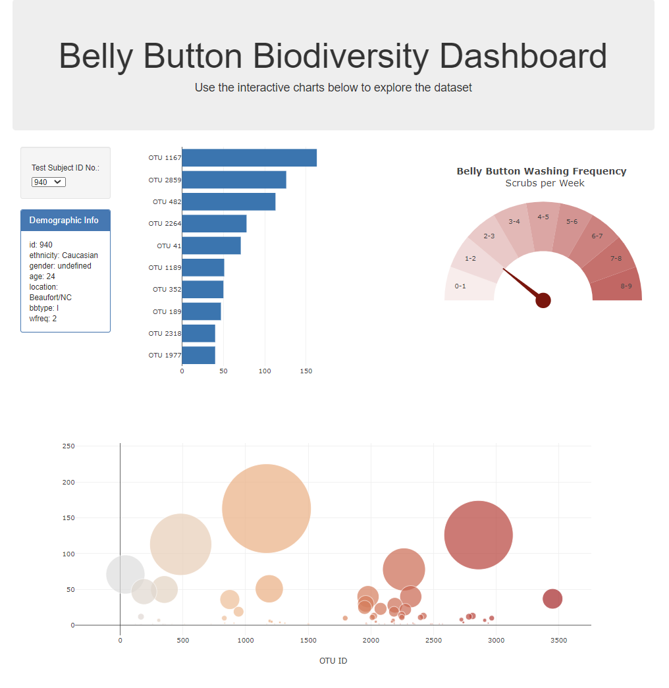

# Plot.ly - Belly Button Biodiversity

Build an interactive dashboard to explore the [Belly Button Biodiversity dataset](http://robdunnlab.com/projects/belly-button-biodiversity/), which catalogs the microbes that colonize human navels.

The dataset reveals that a small handful of microbial species (also called operational taxonomic units, or OTUs, in the study) were present in more than 70% of people, while the rest were relatively rare.

## Step 1: Plotly

1. Using the D3 library to read in `samples.json`.

2. Create a horizontal bar chart with a dropdown menu to display the top 10 OTUs found in one individual.

    * Using `sample_values` as the values for the bar chart.

    * Using `otu_ids` as the labels for the bar chart.

    * Using `otu_labels` as the hovertext for the chart.

3. Create a bubble chart that displays each sample.

    * Using `otu_ids` for the x values.

    * Using `sample_values` for the y values.

    * Using `sample_values` for the marker size.

    * Using `otu_ids` for the marker colors.

    * Using `otu_labels` for the text values.

4. Display the sample metadata, i.e., an individual's demographic information.

5. Display each key-value pair from the metadata JSON object somewhere on the page.

6. Update all of the plots any time that a new sample is selected.

#### Consideration
Refer to the [Plotly.js documentation](https://plot.ly/javascript/) when building the plots.

## Step 2: Gauge Chart

* Adapt the Gauge Chart from <https://www.instructables.com/Showing-Charts-and-Gauges-of-IOT-Device-Data-Using/> to plot the weekly washing frequency of the individual.

* Modify the example gauge code to account for values ranging from 0 through 9.

* Update the chart whenever a new sample is selected.

## Create any layout that you would like for your dashboard. Here is an example:

- - -
## References

Hulcr, J. et al.(2012) _A Jungle in There: Bacteria in Belly Buttons are Highly Diverse, but Predictable_. Retrieved from: [http://robdunnlab.com/projects/belly-button-biodiversity/results-and-data/](http://robdunnlab.com/projects/belly-button-biodiversity/results-and-data/)

- - -

© 2021 Trilogy Education Services, LLC, a 2U, Inc. brand. Confidential and Proprietary. All Rights Reserved.
